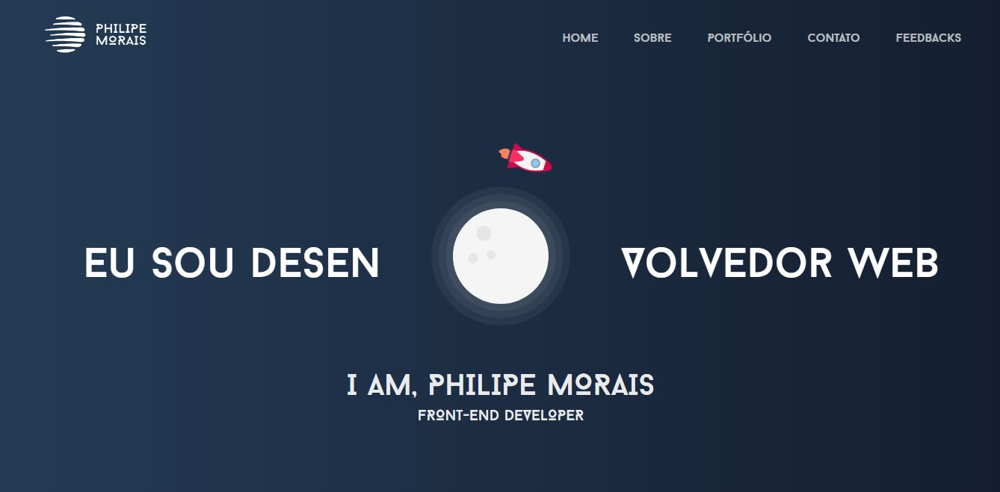

# Portfólio

## Portfólio pessoal, feito utilizando HTML, CSS, Bootstrap e JavaScript. 

### Design

A ideia principal seria criar algo simples e fácil para se visualizar, cheguei a conclusão de usar poucos elementos para que contribuisse com um design mais limpo e harmonioso.

### Responsividade

O portfólio é totalmente responsivo para smartphones, tablets e desktops.

### Frameworks

Os frameworks utilizados foram o Bootstrap, biblioteca para o CSS e o ScrollReveal.JS para o JavaScript, servindo para que quando use o scroll, possamos ver alguns elementos surgindo na tela.

## Imagem do Projeto Finalizado

